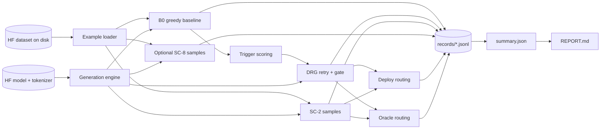
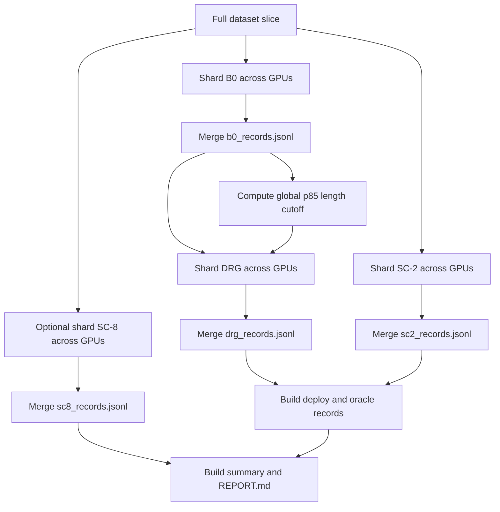

# Deployable DRG -> SC-2 Architecture

This document describes the active implementation in this folder for paper writing and figure building. The active runner is the top-level [run_pipeline.py](run_pipeline.py). The nested `deployable_drg_sc2/` package is a portable copy and can lag behind the top-level files.

## One-Sentence System View

The pipeline runs a cheap greedy baseline first, detects pathological generations, selectively retries those cases, accepts a retry only under a fixed agreement/pathology gate, and uses SC-2 only as a deployable fallback when the selected DRG path has no extractable answer.

For concrete AMC and AIME 2024 examples with actual prompts and B0-vs-DRG outcomes, see [flow_emnlp.md](flow_emnlp.md). For longer before/after snippets from real JSONL artifacts, see [actual_output_flows.md](actual_output_flows.md).

## Repository Map

| File | Role in the system |
| --- | --- |
| [run_pipeline.py](run_pipeline.py) | Main single-process runner. It implements loading, prompting, generation, triggers, retry, gates, SC-2/SC-8, deploy routing, oracle routing, summaries, and reports. |
| [launch_multi_gpu.py](launch_multi_gpu.py) | Multi-GPU data-sharding launcher. It runs B0, SC-2, optional SC-8, then DRG with one shared global length cutoff. |
| [answer_normalization.py](answer_normalization.py) | Answer cleanup and math equivalence dispatch, including a timeout-protected symbolic matcher fallback path. |
| [symbolic_math.py](symbolic_math.py) | Local symbolic math fallback used when SkyThought-style scoring is unavailable. |
| [fetch_dataset.py](fetch_dataset.py) | Dataset bootstrap helper for MATH-500, AIME, AMC, GSM8K, GPQA Diamond, and other datasets. |
| [download_model.py](download_model.py) | Hugging Face model download helper for creating local `--model_path` directories. |
| [rebuild_report.py](rebuild_report.py) | Regeneration-free report builder from completed JSONL records. |
| [compare_drg_runs.py](compare_drg_runs.py) | Paired comparison of two DRG runs, useful for ablations such as retry prompt or trigger replacement. |
| [aggregate_seed_runs.py](aggregate_seed_runs.py) | Aggregates multiple completed runs for seed-variance reporting. |
| [build_component_baselines.py](build_component_baselines.py) | Post-hoc component baselines from one completed run. |
| [run_livecodebench.py](run_livecodebench.py) | Separate coding-task adaptation of the same generate, detect, retry, and route idea. |

## Canonical Naming

Paper-facing model names should use official display names, while run provenance should keep the exact local checkpoint path. This is especially important for Ministral: the official product/model-card name is **Ministral 3 14B** with served model id `ministral-14b-2512`; the local experiments used the Hugging Face reasoning checkpoint `mistralai/Ministral-3-14B-Reasoning-2512`, stored at `base_llms/Ministral-3-14B-Reasoning-2512`.

| Paper label | Exact checkpoint / source id | Local path used in runs |
| --- | --- | --- |
| Qwen3-8B | `Qwen/Qwen3-8B` | `base_llms/Qwen3-8B` |
| Qwen3-14B | `Qwen/Qwen3-14B` | `base_llms/Qwen3-14B` |
| DS-R1-Qwen-7B | `deepseek-ai/DeepSeek-R1-Distill-Qwen-7B` | `base_llms/DeepSeek-R1-Distill-Qwen-7B` |
| DS-R1-Llama-8B | `deepseek-ai/DeepSeek-R1-Distill-Llama-8B` | `base_llms/DeepSeek-R1-Distill-Llama-8B` |
| Ministral 3 14B | official/API id `ministral-14b-2512`; HF checkpoint `mistralai/Ministral-3-14B-Reasoning-2512` | `base_llms/Ministral-3-14B-Reasoning-2512` |

Dataset names should also be kept canonical in paper tables while preserving local paths in provenance:

| Paper label | Local dataset path | Notes |
| --- | --- | --- |
| MATH-500 | `datasets/math500` | 500 math problems; main 4k budget benchmark. |
| AIME 2024 | `datasets/aime_2024` | 30 problems; used at 4k and 32k budgets. |
| AMC | `datasets/amc` | 40 problems; used at 4k and 32k budgets. |
| GSM8K | `datasets/gsm8k` | 8792 grade-school math problems. |
| GPQA Diamond | `datasets/gpqa_diamond` | 198 multiple-choice science problems; 32k budget runs. |
| OlympiadBench Physics OE-to-EN | `datasets/olympiadbench_physics_oe_to_en` | Physics-track stress benchmark. |

## High-Level Runtime Architecture



## Core Method Components

### 1. Example and Prompt Layer

`load_or_build_examples(...)` reads a Hugging Face dataset saved with `datasets.load_from_disk(...)`. Each row is normalized into:

| Field | Meaning |
| --- | --- |
| `problem_id` | Dataset index used for deterministic sharding and seeds. |
| `unique_id` | Dataset-provided id or a generated id. |
| `problem` | Problem text sent to the model. |
| `raw_gold_answer` | Unmodified gold answer. |
| `gold_answer` | Normalized answer for non-MATH datasets. |
| `dataset_type` | One of `math500`, `gsm8k`, or `gpqa_diamond`. |

The default math prompt is:

```text
System: You are a helpful math assistant. Think step by step and give the final answer in \boxed{}.
User: {problem_text}
```

The prompt is rendered through `tokenizer.apply_chat_template(...)` with `add_generation_prompt=True`. Qwen3 thinking mode can be controlled with `--enable_thinking auto|true|false`.

### 2. Generation Engine

`generate_one(...)` is the common model call for all methods. It:

- builds the chat prompt;
- optionally appends an assistant prefix for continuation-style retry;
- seeds sampled generations with `make_generation_seed(...)`;
- calls `model.generate(...)`;
- decodes only newly generated tokens;
- extracts and normalizes a final answer.

Baseline B0 is greedy:

```text
do_sample = False
temperature = None
top_p = None
```

SC and retry generations are sampled by default:

```text
do_sample = True
temperature = 0.7
top_p = 0.95
```

### 3. Answer Extraction and Scoring

`extract_predicted_answer(...)` first removes model-internal thinking text after `</think>` when present.

Extraction rules:

| Dataset type | Extractor |
| --- | --- |
| `math500` and math-style datasets | Last balanced `\boxed{...}` expression. |
| `gsm8k` | Last `\boxed{...}` if present, otherwise `#### number`. |
| `gpqa_diamond` | `\boxed{A}` through `\boxed{D}` or final textual answer pattern. |

Math scoring uses `normalize_math_answer(...)`, exact normalized string equality, and then symbolic equivalence with a 5-second timeout. The import order is SkyThought if installed, then local [symbolic_math.py](symbolic_math.py), then package fallback paths.

### 4. Trigger Layer

The default deployable trigger source is the heuristic trigger:

```text
triggered = repetition_hit OR length_hit OR stall_hit
```

The three default signals are:

| Signal | Code definition | Default |
| --- | --- | --- |
| Repetition | `1 - unique_whitespace_tokens / whitespace_tokens` | `>= 0.7` |
| Length | Baseline output token count | `>= p85` of baseline token counts |
| Stall | Last `k` non-empty lines introduce no new alphabetic identifiers | `k = 4` |

The runner also supports `--trigger_source wsc`, `external`, `random`, `all`, and `none`. Even when WSC or external triggers are used, the default pathology gate still uses the three heuristic signals.

### 5. Retry Construction

DRG only retries triggered examples. The retry can be configured in two prompt modes:

| Mode | Construction |
| --- | --- |
| `user` | Re-ask the original problem, optionally add `Restart from scratch...`, and optionally append a tail of the baseline attempt under `Previous attempt (may be flawed):`. |
| `assistant_continuation` | Encode the original problem and append the full baseline assistant trace as an assistant prefix, then continue generation. |

Important paper-facing settings:

| Condition | Key flags |
| --- | --- |
| Clean sampled retry | `--retry_temperature 0.7 --retry_previous_attempt_chars 0 --retry_instruction_mode none` |
| Previous-attempt retry | `--retry_temperature 0.7 --retry_previous_attempt_chars 1200 --retry_instruction_mode none --retry_previous_attempt_variant real` |
| Strict greedy retry ablation | `--retry_temperature 0` |
| Assistant continuation ablation | `--retry_prompt_mode assistant_continuation --retry_previous_attempt_chars 0` |

The CLI code default for `--retry_previous_attempt_chars` is `0`; current paper-aligned previous-attempt runs should pass `1200` explicitly.

### 6. DRG Acceptance Gate

After a triggered retry, DRG compares the extracted baseline answer and retry answer:

```text
agree = answers_equal(baseline_pred, retry_pred)
high_pathology = trigger_signal_count >= gate_pathology_threshold
```

Default gate policy is `--gate_policy pathology` with:

```text
gate_pathology_threshold = 2
```

Decision table:

| Triggered? | Retry agrees with baseline? | High pathology? | DRG selected output |
| --- | --- | --- | --- |
| No | n/a | n/a | Baseline |
| Yes | Yes | n/a | Baseline |
| Yes | No | Yes | Retry |
| Yes | No | No | Baseline |

The other gate policies are controls:

| Policy | Behavior |
| --- | --- |
| `accept_all_disagreements` | Accept any retry that disagrees with the baseline answer. |
| `never_accept` | Never accept a disagreeing retry. |

### 7. Deployable SC-2 Fallback

The deployable method is not "always DRG plus SC-2." It routes to SC-2 only for no-extractable-answer paths in the non-triggered baseline branch, the accepted high-pathology retry branch, and the low-pathology keep-baseline branch. In the math-style paper runs, the answer-agreement branch already requires extractable equivalent answers, so preserving the baseline there is still a deployable answer path.

SC-2 selection rule:

```text
if sample 1 and sample 2 are extractable and agree: return sample 1
if sample 1 and sample 2 are extractable and disagree: return sample 1
if only sample 1 is extractable: return sample 1
if only sample 2 is extractable: return sample 2
otherwise: return no-answer
```

SC-8 is an evaluation baseline. It clusters normalized answers by equivalence and returns the largest cluster, tie-broken by earliest sample.

### 8. Oracle Routing

`DRG -> SC-2 (oracle)` is an analysis upper-bound/control. It routes DRG failures to SC-2 using gold correctness. It is not deployable because it depends on knowing whether DRG was correct.

## Output Contract

Each run writes under:

```text
outputs_standalone/deployable_drg_sc2/<dataset>/<model>/<run_name_or_timestamp>/
```

Main files:

| File | Meaning |
| --- | --- |
| `config.json` or `launcher_config.json` | CLI configuration used for the run. |
| `progress.json` | Current status for single-process runs or shard workers. |
| `records/b0_records.jsonl` | Greedy baseline text, answer, correctness, and token count. |
| `records/drg_records.jsonl` | Trigger signals, retry text/answer, gate decision, final DRG answer, and token count. |
| `records/sc2_records.jsonl` | Two sampled answers, selected answer, selection reason, correctness, and token count. |
| `records/sc8_records.jsonl` | Optional eight-sample self-consistency baseline. |
| `records/deploy_records.jsonl` | Deployable DRG -> SC-2 path, fallback usage, final answer, and token accounting. |
| `records/oracle_records.jsonl` | Oracle DRG -> SC-2 control. |
| `summary.json` | Machine-readable aggregate metrics, overlap, fallback stats, and path counts. |
| `REPORT.md` | Paper-facing run report rendered from `summary.json`. |

Useful per-row fields for figure annotations:

| File | Fields |
| --- | --- |
| `drg_records.jsonl` | `triggered`, `trigger_signal_count`, `accepted_retry`, `decision_reason`, `drg_final_source`, `baseline_correct`, `drg_final_correct` |
| `deploy_records.jsonl` | `path`, `fallback_used`, `fallback_reason`, `final_predicted_answer`, `total_tokens` |
| `summary.json` | `results`, `overlap`, `fallback`, `drg_transitions`, `deploy_path_counts` |

## Multi-GPU Architecture

`launch_multi_gpu.py` uses data parallel sharding. Its key guarantee is that the length trigger is global, not shard-local:



Use it when one worker fits on one GPU and you want throughput. Use `run_pipeline.py --device_map auto` instead when a single model/context must be sharded across multiple visible GPUs.

## What You Need To Reproduce or Port

Required:

- this `standalone/deployable_drg_sc2/` folder;
- Python packages in [requirements.txt](requirements.txt);
- a local Hugging Face CausalLM model directory for `--model_path`;
- a local Hugging Face dataset saved with `save_to_disk(...)` for `--dataset_path`;
- enough GPU memory for the model and `--max_new_tokens` budget.

Optional but recommended:

- SkyThought math evaluator for closer symbolic scoring parity;
- WSC/Xie probe and local WordSaladChopper checkout for `--trigger_source wsc`;
- multiple GPUs for `launch_multi_gpu.py`;
- `--save_sample_texts` when auditing SC generations, at the cost of larger JSONL files.

## Extension Points

| Goal | Where to edit |
| --- | --- |
| Add a new dataset schema | `get_example_fields(...)`, `infer_dataset_type(...)`, and possibly `system_prompt(...)` in [run_pipeline.py](run_pipeline.py). |
| Add a new answer format | `extract_predicted_answer(...)` and `normalize_answer(...)`. |
| Change trigger logic | `repetition_unigram(...)`, `stalled_no_new_symbols(...)`, `run_greedy_drg(...)`, or the `--trigger_source` path. |
| Change retry prompt | `build_retry_problem_text(...)` and `generate_one(..., assistant_prefix_text=...)`. |
| Change deploy fallback | `build_deploy_records(...)`. |
| Change reporting | `build_summary(...)` and `render_report(...)`. |

## Paper-Facing Method Names

| Name in paper/table | Implementation artifact |
| --- | --- |
| B0 | `records/b0_records.jsonl` |
| DRG | `records/drg_records.jsonl`, field `drg_final_*` |
| SC-2 | `records/sc2_records.jsonl` |
| SC-8 | `records/sc8_records.jsonl` |
| DRG -> SC-2 oracle | `records/oracle_records.jsonl` |
| DRG -> SC-2 deploy | `records/deploy_records.jsonl` |
