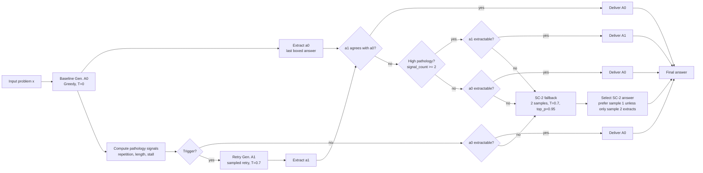
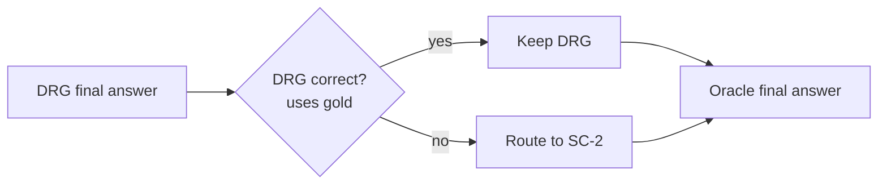

# EMNLP-Style Flow for Deployable DRG -> SC-2

This is the paper-facing flow corresponding to the implementation in [run_pipeline.py](run_pipeline.py), shaped to match the structure of `emnlp_image.png`: input, baseline generation, trigger check, retry generation, agreement/pathology gate, deliverable answer, and SC-2 fallback.

## Figure-Ready Flow



## Exact Deploy Logic

For each problem `x`:

1. Generate the greedy baseline output `A0`.
2. Extract `a0` from `A0`.
3. Compute the three default pathology signals on `A0`:
   - `repetition_hit = repetition_unigram(A0) >= 0.7`
   - `length_hit = baseline_tokens >= p85(baseline_token_counts)`
   - `stall_hit = last 4 non-empty lines introduce no new alphabetic identifiers`
4. Trigger DRG when at least one signal fires.
5. If not triggered:
   - return `A0` if `a0` is extractable;
   - otherwise route to SC-2 fallback.
6. If triggered, generate retry `A1`.
7. Extract `a1` from `A1`.
8. If `a1` agrees with `a0`, keep `A0`. In the math-style paper runs, this agreement requires extractable equivalent answers.
9. If `a1` disagrees with `a0`, accept `A1` only when `signal_count >= 2`.
10. If the selected non-triggered, high-pathology retry, or low-pathology keep-baseline path has no extractable answer, route to SC-2 fallback.
11. SC-2 fallback runs two sampled generations and selects:
    - sample 1 if both answers are extractable and agree;
    - sample 1 if both answers are extractable and disagree;
    - the only extractable answer if exactly one sample extracts;
    - no-answer if neither extracts.

## Code-Aligned Pseudocode

```text
for each problem x:
    A0 = generate(x, greedy=True)
    a0 = extract_answer(A0)

    rep_hit = repetition_unigram(A0) >= 0.7
    len_hit = tokens(A0) >= global_p85_baseline_length
    stall_hit = stalled_no_new_symbols(A0, n_lines=4)
    signal_count = rep_hit + len_hit + stall_hit
    triggered = signal_count >= 1

    if not triggered:
        if a0 is not None:
            return A0
        return SC2_fallback(x)

    retry_prompt = build_retry_prompt(x, A0)
    A1 = generate(retry_prompt, T=0.7, top_p=0.95)
    a1 = extract_answer(A1)

    if answers_equal(a0, a1):
        return A0

    if signal_count >= 2:
        if a1 is not None:
            return A1
        return SC2_fallback(x)

    if a0 is not None:
        return A0
    return SC2_fallback(x)
```

## What To Draw in the EMNLP Figure

Use these exact nodes if you want a clean paper figure:

| Figure node | Implementation meaning | Key record fields |
| --- | --- | --- |
| User input `x` | Dataset problem text | `problem_id`, `unique_id` |
| Baseline Gen. `A0` | Greedy B0 generation | `baseline_text`, `baseline_tokens`, `baseline_predicted_answer` |
| Trigger Check | Repetition, length, or stall trigger | `trigger_rep_hit`, `trigger_length_hit`, `trigger_stall_hit`, `triggered` |
| Retry Gen. `A1` | Sampled retry for triggered rows | `retry_text`, `retry_tokens`, `retry_predicted_answer` |
| Agreement Check | Answer-level equivalence between `a0` and `a1` | `agree_with_baseline_answer` |
| Severe Issue or Pathology Detection | Requires at least two pathology signals | `trigger_signal_count`, `high_pathology` |
| Deliverable `A0` | Baseline retained | `drg_final_source = baseline` or deploy paths `path_A`, `path_B_agree`, `path_B_keep` |
| Deliverable `A1` | Retry accepted | `drg_final_source = retry`, deploy path `path_B_accept` |
| Final Answer Validation | Checks whether selected path has an extractable answer | `final_predicted_answer`, `fallback_used` |
| SC-2 Fallback | Two-sample fallback only for no-answer DRG paths | `fallback_reason`, `fallback_choice`, `sc_tokens` |

## Branch Labels for the Paper

| Branch | Label |
| --- | --- |
| `Trigger? -> no` | No pathology detected. Keep baseline if answer extracts. |
| `Trigger? -> yes` | Potential pathological trace. Regenerate once. |
| `Agreement? -> yes` | Retry confirms baseline answer. Keep baseline. |
| `Agreement? -> no` and `High pathology? -> yes` | Strong pathology plus disagreement. Accept retry. |
| `Agreement? -> no` and `High pathology? -> no` | Weak pathology. Preserve baseline. |
| `extractable? -> no` | No deployable answer. Route to SC-2 fallback. |

## Recommended Caption

```text
Deployable DRG -> SC-2. The model first produces a greedy baseline answer A0. A lightweight trigger detects repetition, excessive length, or stalling. Triggered cases receive one sampled retry A1. If A1 agrees with A0, the system preserves A0; if it disagrees, A1 is accepted only under high pathology, defined as at least two trigger signals. The deployable SC-2 fallback is invoked only when the selected DRG path has no extractable final answer.
```

## Settings To Put Beside the Figure

```text
B0: greedy decoding, T=0
Trigger: repetition >= 0.7 OR length >= p85 OR stall(k=4)
Retry: T=0.7, top_p=0.95
Gate: accept disagreeing retry only if signal_count >= 2
Fallback: SC-2 only for no-extractable-answer paths
SC-2: K=2, T=0.7, top_p=0.95
```

If the figure is for the previous-attempt condition, add:

```text
Retry prompt: original problem + last 1200 characters of A0 under "Previous attempt (may be flawed):"
```

If the figure is for the clean retry control, add:

```text
Retry prompt: original problem only
```

## Worked Examples From Saved Runs

The examples below come from the saved Qwen3-8B previous-attempt runs:

```text
AMC run:
outputs_standalone/deployable_drg_sc2/amc/Qwen3-8B/amc_qwen3_8b_fp16_4k_t07_previous_only_thinking_4gpu/

AIME 2024 run:
outputs_standalone/deployable_drg_sc2/aime_2024/Qwen3-8B/aime2024_qwen3_8b_fp16_4k_t07_previous_only_thinking_4gpu/
```

Both runs used:

```text
model_path = base_llms/Qwen3-8B
max_new_tokens = 4096
retry_temperature = 0.7
retry_top_p = 0.95
retry_previous_attempt_chars = 1200
enable_thinking = true
```

### AMC Example: Coinland

Actual prompt shape:

```text
System: You are a helpful math assistant. Think step by step and give the final answer in \boxed{}.

User: In the state of Coinland, coins have values $6,10,$ and $15$ cents.
Suppose $x$ is the value in cents of the most expensive item in Coinland
that cannot be purchased using these coins with exact change. What is the
sum of the digits of $x?$
```

Record-level outcome, `problem_id = 1`:

| Field | Value |
| --- | --- |
| Gold answer | `11` |
| B0 extracted answer | `None` |
| B0 correctness | wrong |
| B0 tokens | `4096` |
| Trigger signals | repetition `1`, length `1`, stall `1` |
| `trigger_signal_count` | `3` |
| High pathology? | yes |
| Retry extracted answer | `11` |
| Retry correctness | correct |
| Agreement with B0? | no, because B0 had no extractable answer |
| DRG decision | `disagree_high_pathology_accept_retry` |
| Deploy path | `path_B_accept` |
| SC-2 fallback used? | no |
| Final DRG/deploy answer | `11`, correct |

This is the cleanest visual story for the figure: the baseline generation stalls or runs long enough that no boxed answer is extractable, all trigger signals fire, and the sampled retry recovers the correct answer. The deployable route accepts `A1` directly and does not spend SC-2 tokens.

### AIME 2024 Example: Aya's Walk

Actual prompt shape:

```text
System: You are a helpful math assistant. Think step by step and give the final answer in \boxed{}.

User: Every morning Aya goes for a $9$-kilometer-long walk and stops at a coffee
shop afterwards. When she walks at a constant speed of $s$ kilometers per hour,
the walk takes her 4 hours, including $t$ minutes spent in the coffee shop.
When she walks $s+2$ kilometers per hour, the walk takes her 2 hours and
24 minutes, including $t$ minutes spent in the coffee shop. Suppose Aya walks
at $s+\frac{1}{2}$ kilometers per hour. Find the number of minutes the walk
takes her, including the $t$ minutes spent in the coffee shop.
```

Record-level outcome, `problem_id = 0`:

| Field | Value |
| --- | --- |
| Gold answer | `204` |
| B0 extracted answer | `None` |
| B0 correctness | wrong |
| B0 tokens | `4096` |
| Trigger signals | repetition `1`, length `1`, stall `0` |
| `trigger_signal_count` | `2` |
| High pathology? | yes |
| Retry extracted answer | `204` |
| Retry correctness | correct |
| Agreement with B0? | no, because B0 had no extractable answer |
| DRG decision | `disagree_high_pathology_accept_retry` |
| Deploy path | `path_B_accept` |
| SC-2 fallback used? | no |
| Final DRG/deploy answer | `204`, correct |

This is a good AIME-side companion example: the baseline again exhausts the 4096-token budget without an extractable answer, but the retry produces the expected `\boxed{204}`. Because two pathology signals are active, the gate accepts the retry.

### Run-Level Context

These examples are representative of the 4k Qwen3-8B previous-attempt setting, where DRG mainly helps by turning no-answer pathological traces into extractable retry answers.

| Dataset/run | B0 | DRG | SC-2 | Deploy path counts |
| --- | ---: | ---: | ---: | --- |
| AMC, 40 problems | `12/40 = 0.300` | `19/40 = 0.475` | `14/40 = 0.350` | `path_A: 5`, `path_B_agree: 7`, `path_B_accept: 7`, `path_C_triggered: 21` |
| AIME 2024, 30 problems | `0/30 = 0.000` | `5/30 = 0.167` | `1/30 = 0.033` | `path_B_accept: 5`, `path_C_triggered: 25` |

For longer before/after snippets from the actual JSONL artifacts, see [actual_output_flows.md](actual_output_flows.md).

For the figure, the two worked examples above both instantiate the same branch:

```text
Input x -> B0 -> Trigger yes -> Retry A1 -> Agreement no -> High pathology yes -> Deliver A1
```

## Optional Analysis-Only Branch

The code also reports an oracle control:



Do not include this branch in the main deployable figure unless you label it as an analysis upper bound, because it uses gold correctness and is not available at inference time.
